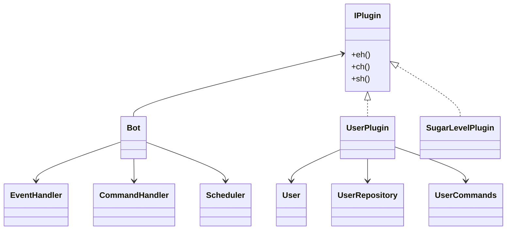

# Architecture

```mermaid
classDiagram

class IPlugin {
  +eh()
  +ch()
  +sh()
}

Bot --> EventHandler
Bot --> CommandHandler
Bot --> Scheduler
IPlugin <-- Bot
IPlugin <|.. UserPlugin
IPlugin <|.. SugarLevelPlugin
UserPlugin --> User
UserPlugin --> UserRepository
UserPlugin --> UserCommands
```
