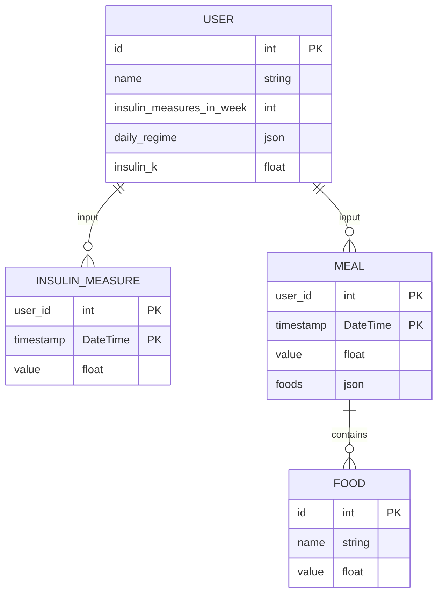

# Data Schema

```mermaid
erDiagram

USER {
  id int PK
  name string
  insulin_measures_in_week int
  daily_regime json
  insulin_k float
}

INSULIN_MEASURE {
  user_id int PK
  timestamp DateTime PK
  value float
}

MEAL {
  user_id int PK
  timestamp DateTime PK
  value float
  foods json
}

FOOD {
  id int PK
  name string
  value float
}

USER ||--o{ INSULIN_MEASURE : input
USER ||--o{ MEAL : input
MEAL ||--o{ FOOD : contains
```
